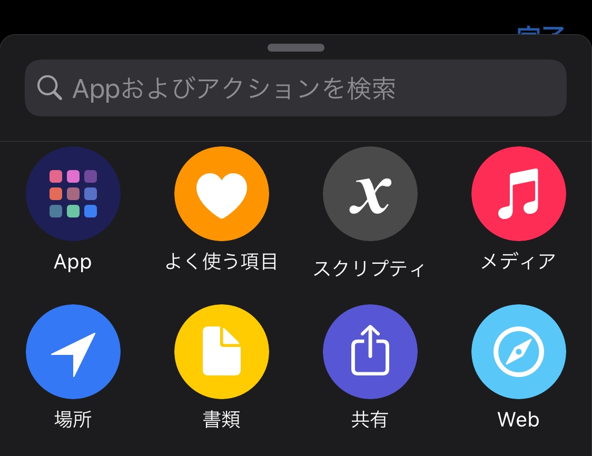
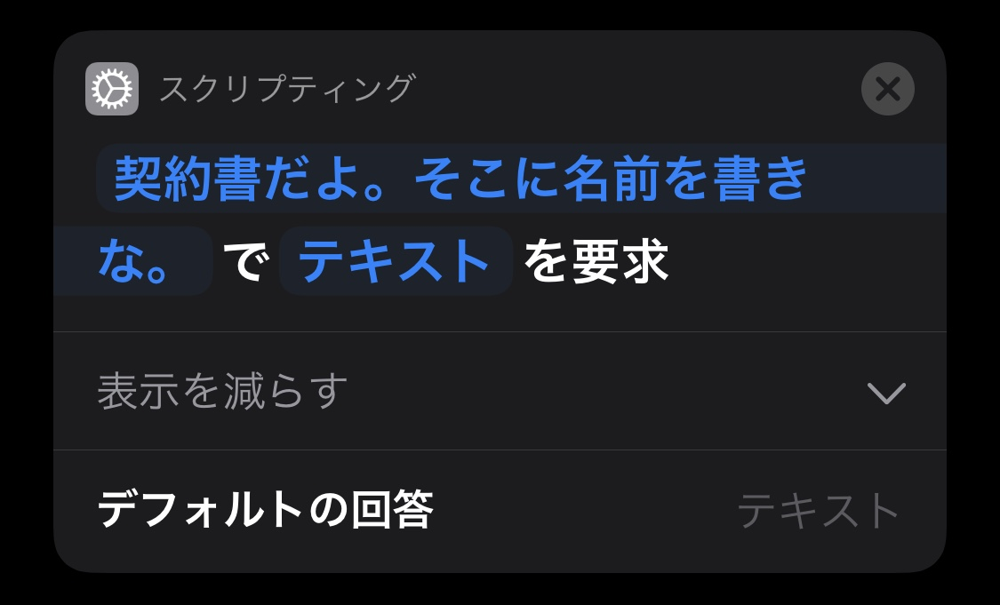
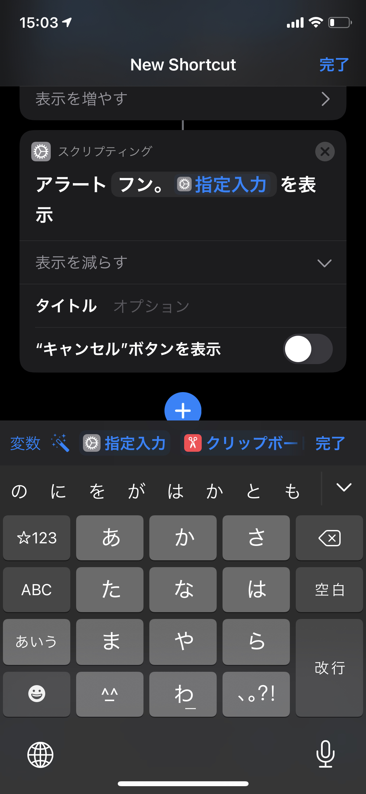
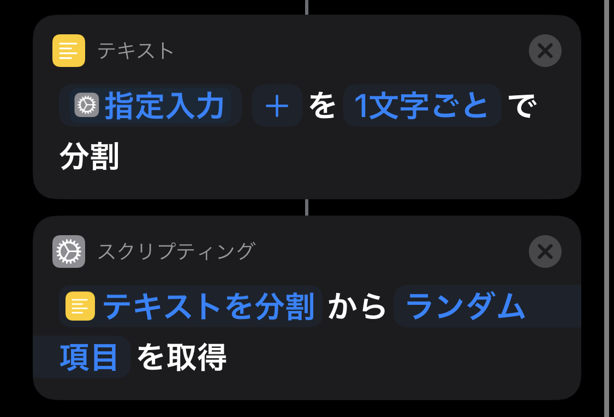
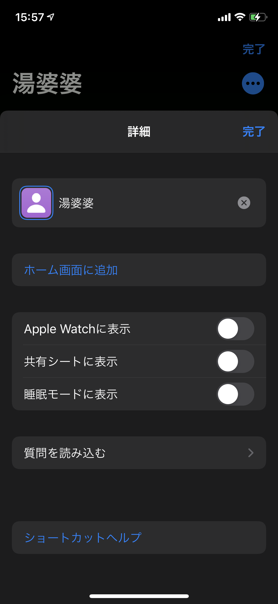
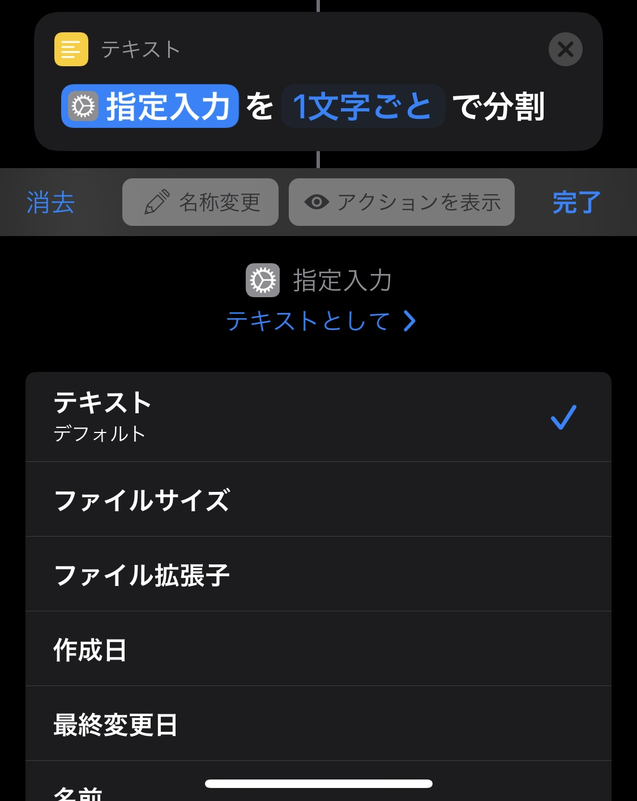

# Siri湯婆婆（iOS ショートカット入門）

天邪鬼なので簡単に流行りに乗るのもいかがなものかと思ったのですが、これなら他人と差別化もできてるし……というわけで書きました。果たしてショートカットは技術記事なのか疑問ですが、まあ大丈夫でしょう。

## ショートカットについて

AppleがWorkflowというアプリを買収して改良？[^moment]したものです。iOS 12からApp Storeで提供され、iOS 13からプリインストールされています。__簡単なツールを作る__のにはもってこいだと思います。自分用のCLIコマンドみたいイメージです。（もちろん[ShortcutsGallery.com](https://shortcutsgallery.com/)なんかで広く共有されているものもあります。）iOS 14ではアプリのアイコンが変えられる！なんて巷では話題になってましたが、ここでは本来の使い方をしてあげましょう。

[^moment]: [ショートカットの愚痴](https://twitter.com/i/events/1325415788203831296)

## 完成形

<blockquote class="twitter-tweet">
ショートカット湯婆婆 <a href="https://t.co/DiCYvQu4FM">pic.twitter.com/DiCYvQu4FM</a>
&mdash; まさし (@MasasaM_shi) <a href="https://twitter.com/MasasaM_shi/status/1325703054079913986?ref_src=twsrc%5Etfw">November 9, 2020</a></blockquote> 

[リンクはこちら](https://www.icloud.com/shortcuts/106215fddf0a44d4b451a67da19a30b0)です。他人の作ったショートカットを追加するには`設定->ショートカット->信頼されていないショートカットを許可する（Allow untrusted shortcuts）`をオンにする必要があります。

## 作り方

簡単なんでどこまで書くべきかわからず、無駄に詳細まで書いてしまいました。

### 開く

何はともあれ開かないと始まりません。iOS端末を持ってない人は買い、iOS 12未満の人はOSアップデート、iOS 12の人はApp Storeからインストール。ただ今回使うアクションがいつからあるものかは調べてません。下手したらiOS 14以降でしか使えないかも。

### 名前を聞く

`アクションを追加（Add Action）`ボタンを押して、`入力を要求（Ask for input）`を追加します。`スクリプティング（Scripting）`の中にありますが、数が多いので検索したほうが早いです。設定と画面サイズによっては`スクリプティ`までしか表示されないクソ仕様付き。僕はこれが嫌で端末の設定を英語にしてます。

追加したアクションの`プロンプト（Prompt）`に「契約書だよ。そこに名前を書きな。」と書きます。

デバッグするのは簡単です。__右下の▶️ボタンを押すだけ__。実行している箇所もわかるので普通にインタプリタ言語感覚で使えます。

### 文字列埋め込み

次に湯婆婆に喋らせたいので、`アラートを表示（Show Alert）`を追加します。内容は「フン。<名前>というのかい。贅沢な名前だねえ。」なので、先ほど取得した名前を表示させたいので文字列を埋め込む必要があります。と言ってもキーボードの上に常に表示されてるので迷う人はいないでしょう。`指定入力`を選択し、そのまま後半を入力すればOKです。

ついでに`表示を増やす（Show more）`で`"キャンセル"ボタンを表示`をオフにしておきました。

### 1文字抜き出す

残念ながらショートカットのテキストはコレクションではないのでSwiftみたいに`text.randomElement()`みたいな便利な方法はありません。とはいえ2アクションで実装できます。

`テキストを分割`をアクションに追加して、テキストは`指定入力`にします。`改行ごと`は`1文字ごと`に変更しましょう。`リストから項目を取得`で分割したテキスト（`テキストを分割`）から`ランダム項目`を取得します。

### 完成

最後に「今からお前の名前は`リストからの項目`だ。いいかい、`リストからの項目`だよ。分かったら返事をするんだ、`リストからの項目`!!」とアラートを表示するだけです。

あとは右上の三点ドットから（一番上までスクロールしてないと押せないおまけ付き！）ショートカットの名前とアイコンを変えれば完成です。

## Siri

ショートカットで作ったものはそのままSiriから呼び出せます。

<blockquote class="twitter-tweet">
Siri湯婆婆 <a href="https://t.co/HxyMjs6pUw">pic.twitter.com/HxyMjs6pUw</a>
&mdash; まさし (@MasasaM_shi) <a href="https://twitter.com/MasasaM_shi/status/1325704149770461186?ref_src=twsrc%5Etfw">November 9, 2020</a></blockquote> 

これで冷たいプロンプトと湯婆婆ごっこする必要はありません。Siriと湯婆婆ごっこを楽しみましょう！

## おまけ

簡単なTipsとか。

### 変数名

`指定入力`とか`リストからの項目`とか変数名にしたくないというそこのあなた、朗報です。ショートカットには変数名を設定する方法が複数存在します。`変数を設定`というアクションを使うとその変数にアクセスしやすくなります（うまく言語化できない……。下の写真の通りです）。

そしてもう1つは名前だけ変える方法。今回のようにアクション数が少ない場合に有効な手です。変数をタップすると何やら色々設定が出てきます。その中の`名称変更`から自由に名前を変更できます。元の名前でわかりやすかった「どこからきた値なのか」は`アクションを表示`から簡単に確認できるので、困ることはありません。

### ネスト

ショートカットは処理を関数に切り出せません。__ネストが自然と深くなってしまう__ので、`if {} else { if {} }`を`if`2つにうまく分解するなどする必要があります。実はもう1つ方法があって、_他のショートカットに切り出_せばいいのですが、これをすると人に共有しづらくなるためできるだけ避けたほうがいいです。

ただショートカットを関数として扱えるということは再起関数も書けるということです。再起が書けるからって使うか？って話ではあるんですが、どうせならTipsらしく書いときました。下の動画はフィボナッチを作った時のやつです。

<blockquote class="twitter-tweet">
フィボナッチ <a href="https://t.co/gnlePbtMR2">pic.twitter.com/gnlePbtMR2</a>
&mdash; まさし (@MasasaM_shi) <a href="https://twitter.com/MasasaM_shi/status/1325699296155500544?ref_src=twsrc%5Etfw">November 9, 2020</a></blockquote> 

### ドキュメント

まあなにせ簡単なので適当にいじるだけで十分だと思いますが、[ショートカット ユーザガイド](https://support.apple.com/ja-jp/guide/shortcuts/welcome/ios)に割と色々載ってるので、見てみるのもいいかもしれません。
